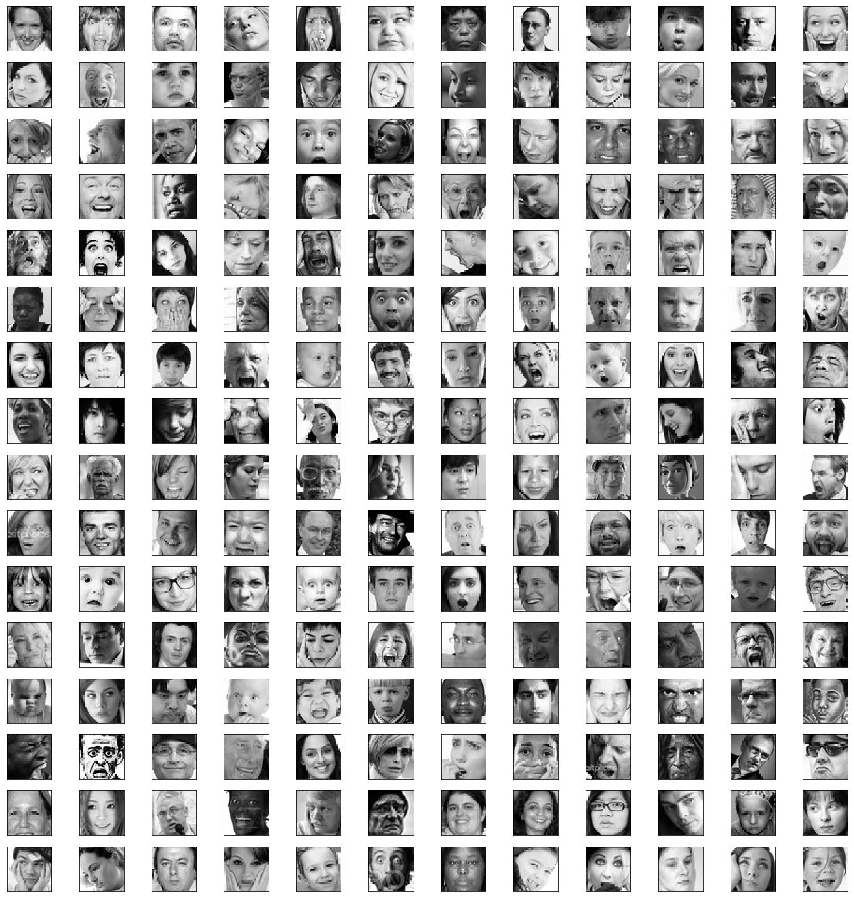
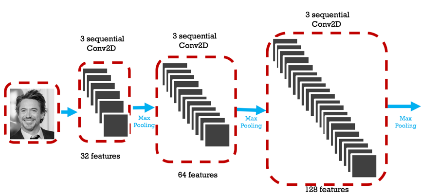
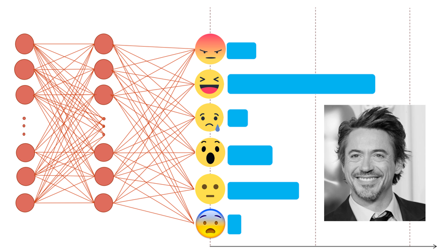
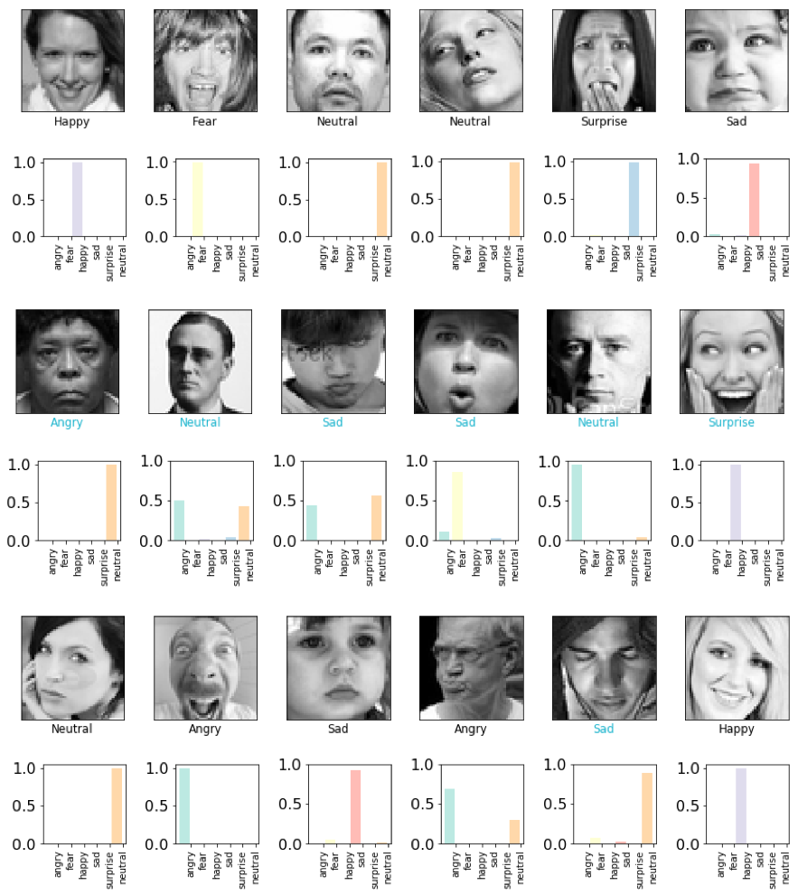
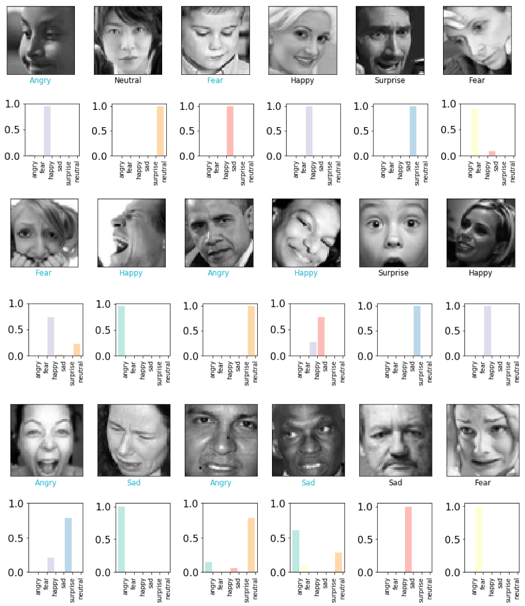
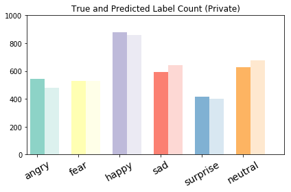

# Deep-Learning-Project-Facial-Expression-Classification
This is the final project for BST261 Data Science II, I implement RNN and CNN for Facial Expression Classification, Data from Kaggle Competition: fer2013

Jiajing Chen, Ruitong, Li

## Data
Here, we obtaind the dataset from the Kaggle competition ["Challenges in Representation Learning: Facial Expression Recognition Challenge"](https://www.kaggle.com/c/challenges-in-representation-learning-facial-expression-recognition-challenge/data). From Kaggle open resource, we had training dataset, public test dataset (which is then used as validation dataset for our project), and further a private dataset (same size with public test dataset and will be used as data for evaluating the prediction performance). It is noteworthy that in original provided dataset (either in training dataset or in public test dataset), we have actually in total 7 categories, apart from "Angry, Surprise, Fear, Happy, Sad and Neutral" that has been presented in our slides, we had an additional tag of "Disgust". However, the main problem will be that we have a quite unbalanced distribution of Disgust label in provided data, it accounts for a unusually low percentage, the obvious unbalance in data distribution will influence further neural network training, therefore we re-classify all pictures with "Disgust" label into "Angry" label. Such re-classification is relatively subjective, completely based on our perception of those two labels. Both of our teammates believe that the muscle movements in Angry face looks highly similar to that for Disgust faces.

## Model Architecture
Here, we first approached this project by specifying out clearly our primary purpose--classify provided greyscale pictures into one out of six labels. The picture classification task natually leads us to well-known Convolutional Neural Network (CNN). After researching around how CNN usually performs for greyscale picture, we decided to start from three sequential convolutional layers followed by a maxpooling layer, common activation function for convolutional layer "relu" is used, as well as the same padding pattern. Then, from the basic structure, we further added more and more convolutional layers with different features captured. The features to be captured from convolutional layer increased from 32 to 128, it is suggested that such hierarchical structure (with increasing layer nodes) performs better for deep neural network. Finally, the convolved layer is first flattened and then go through two more dense layers to reach the output layer in which softmax activation function is used for multiclass classification (six classes in total).

## Model Evaluation

## Conclusion

From above, we have performed several visulization methods to evaluate our trained CNN. First, we plotted the training accuracy/loss versus validation accuracy/loss, from the above plot, we can easily find out that our model actually starts to overfit around 10 epoches, at which validation accuracy reaches its plateau, only oscillated around a stable line while validation loss started to increase. Therefore, we take the validation accuracy 58.62% at epoch 9 as the reported validation accuracy and the validation loss will be around 1.1736. We all know that when predicting one out of six labels randomly, we will have a baseline accuracy around 1/6=16.67%, the validation accuracy as high as 58.62% is satisfactory enough. Therefore, we decided to further examine how our model performs on test dataset.
First, we evaluated our trained CNN on test dataset, the returned test accuracy is still as high as 55.25%. Second, we attempted to plot the input together with its corresponding true label as well as the softmax output (in which a probability will be outputed for each label) in the same plot for test dataset (first 36 pictures are choosen). When the true label is equal to the class with highest probability, we will mark the true label with Black color, otherwise Blue color indicated a wrong classification. From the first 36 outputs, we can easily find out that the softmax output can be pure (Only one class owns a probability larger than 0.9) or relatively impure (two or three classes shares the probability). Some of the pictures are even completely misclassified, for example, object 26 is labled as happy but misclassified by our neural network as angry with nearly 100% certainty. However, the picture can also be perceived easily as angry even by human. Therefore, facial expressions are indeed very difficult to classify due to complicated muscle movements. Further, we decide to display the prediction results with a plot parallelly showing true label counts and prediction label counts side by side. It is noteworthy from the plot that overall, the true counts are very similar to prediction counts. However, considering the test accuracy 55.25% we obtained, there should be some labels completely and easily classified to another label. Finally,the result can be revealed by the confusion matrix. It suggested the label which is most successfully classified is happy, that makes perfect sense given happy data accounts for the main percentage in training data. The label-pair that can cause misclassification will be neutral-sad as well as sad-fear. Based on human perception, we believe the result is pretty reasonable.
